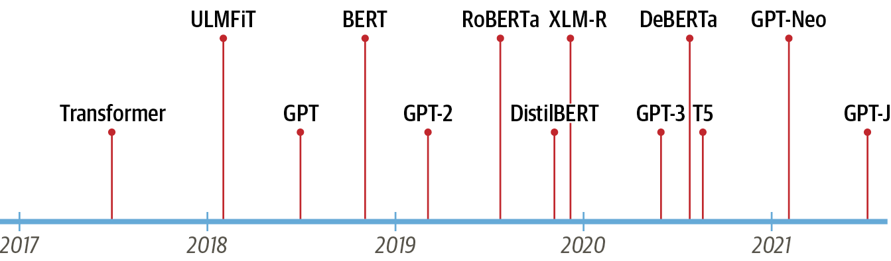
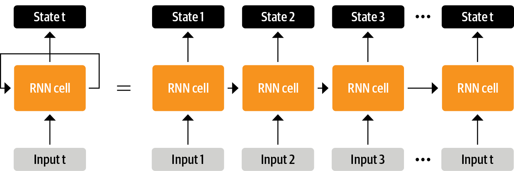
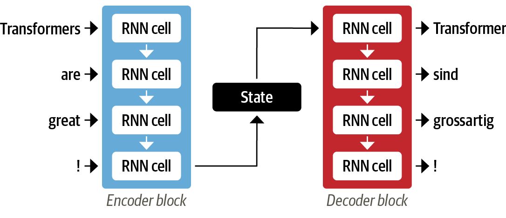
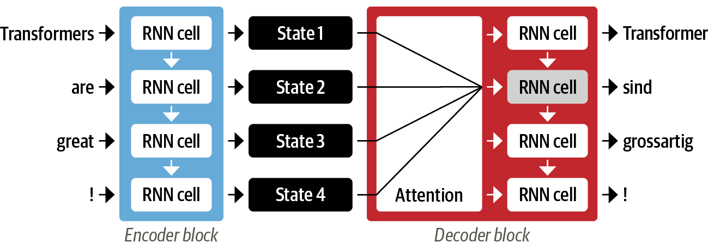
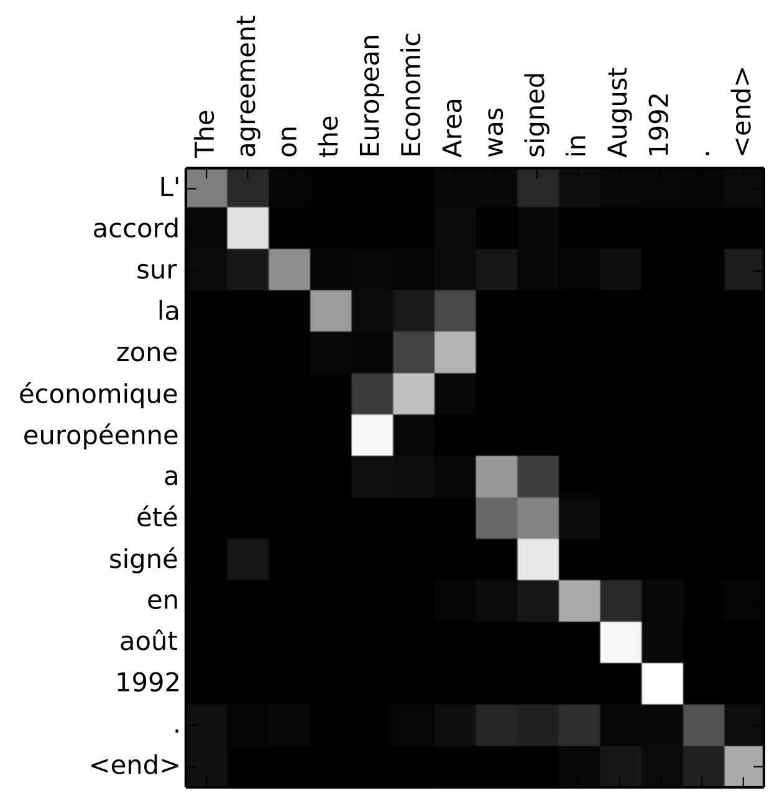
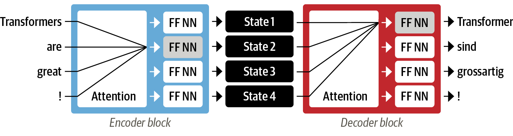
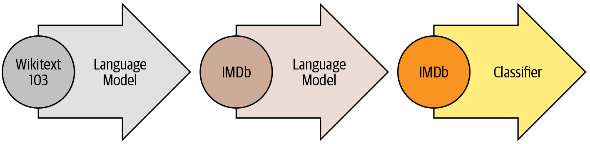
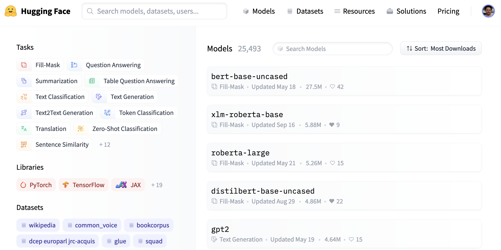
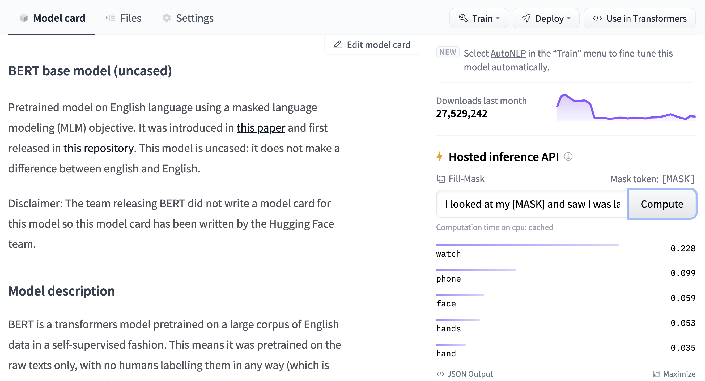

# Hello Transformers

In 2017, researchers at Google published a paper that proposed a novel neural network architecture for sequence modeling [1]. Dubbed the *Transformer*, this architecture outperformed recurrent neural networks (RNNs) on machine translation tasks, both in terms of translation quality and training cost.

In parallel, an effective transfer learning method called ULMFiT showed that training long short-term memory (LSTM) networks on a very large and diverse corpus could produce state-of-the-art text classifiers with little labeled data [2].

These advances were the catalysts for two of today’s most well-known transformers: the Generative Pretrained Transformer (GPT)[3] and Bidirectional Encoder Representations from Transformers (BERT) [4]. By combining the Transformer architecture with unsupervised learning, these models removed the need to train task-specific architectures from scratch and broke almost every benchmark in NLP by a significant margin. Since the release of GPT and BERT, a zoo of transformer models has emerged; a timeline of the most prominent entries is shown in [Figure 1-1].

    

        
        <h4 style="font-family: courier; font-size: .8em;">Figure 1-1. The transformers timeline</h4>
    

But we’re getting ahead of ourselves. To understand what is novel about transformers, we first need to explain:

- The encoder-decoder framework
- Attention mechanisms
- Transfer learning

In this chapter we’ll introduce the core concepts that underlie the pervasiveness of transformers, take a tour of some of the tasks that they excel at, and conclude with a look at the Hugging Face ecosystem of tools and libraries.

Let’s start by exploring the encoder-decoder framework and the architectures that preceded the rise of transformers.

# The Encoder-Decoder Framework

Prior to transformers, recurrent architectures such as LSTMs were the state of the art in NLP. These architectures contain a feedback loop in the network connections that allows information to propagate from one step to another, making them ideal for modeling sequential data like text. As illustrated on the left side of [Figure 1-2], an RNN receives some input (which could be a word or character), feeds it through the network, and outputs a vector called the *hidden state*. At the same time, the model feeds some information back to itself through the feedback loop, which it can then use in the next step. This can be more clearly seen if we “unroll” the loop as shown on the right side of [Figure 1-2]: the RNN passes information about its state at each step to the next operation in the sequence. This allows an RNN to keep track of information from previous steps, and use it for its output predictions.

    

        
        <h4 style="font-family: courier; font-size: .8em;">Figure 1-2. Unrolling an RNN in time</h4>
    

These architectures were (and continue to be) widely used for NLP tasks, speech processing, and time series. You can find a wonderful exposition of their capabilities in Andrej Karpathy’s blog post, [“The Unreasonable Effectiveness of Recurrent Neural Networks”](https://oreil.ly/Q55o0).

One area where RNNs played an important role was in the development of machine translation systems, where the objective is to map a sequence of words in one language to another. This kind of task is usually tackled with an *encoder-decoder* or *sequence-to-sequence* architecture [5], which is well suited for situations where the input and output are both sequences of arbitrary length. The job of the encoder is to encode the information from the input sequence into a numerical representation that is often called the *last hidden state*. This state is then passed to the decoder, which generates the output sequence.

In general, the encoder and decoder components can be any kind of neural network architecture that can model sequences. This is illustrated for a pair of RNNs in [Figure 1-3], where the English sentence “Transformers are great!” is encoded as a hidden state vector that is then decoded to produce the German translation “Transformer sind grossartig!” The input words are fed sequentially through the encoder and the output words are generated one at a time, from top to bottom.

    

        
        <h4 style="font-family: courier; font-size: .8em;">Figure 1-3. An encoder-decoder architecture with a pair of RNNs (in general, there are many more recurrent layers than those shown here)</h4>
    

Although elegant in its simplicity, one weakness of this architecture is that the final hidden state of the encoder creates an *information bottleneck*: it has to represent the meaning of the whole input sequence because this is all the decoder has access to when generating the output. This is especially challenging for long sequences, where information at the start of the sequence might be lost in the process of compressing everything to a single, fixed representation.

Fortunately, there is a way out of this bottleneck by allowing the decoder to have access to all of the encoder’s hidden states. The general mechanism for this is called *attention* [6], and it is a key component in many modern neural network architectures. Understanding how attention was developed for RNNs will put us in good shape to understand one of the main building blocks of the Transformer architecture. Let’s take a deeper look.

# Attention Mechanisms

The main idea behind attention is that instead of producing a single hidden state for the input sequence, the encoder outputs a hidden state at each step that the decoder can access. However, using all the states at the same time would create a huge input for the decoder, so some mechanism is needed to prioritize which states to use. This is where attention comes in: it lets the decoder assign a different amount of weight, or “attention,” to each of the encoder states at every decoding timestep. This process is illustrated in [Figure 1-4], where the role of attention is shown for predicting the third token in the output sequence.

    

        
        <h4 style="font-family: courier; font-size: .8em;">Figure 1-4. An encoder-decoder architecture with an attention mechanism for a pair of RNNs</h4>
    

By focusing on which input tokens are most relevant at each timestep, these attention-based models are able to learn nontrivial alignments between the words in a generated translation and those in a source sentence. For example, [Figure 1-5] visualizes the attention weights for an English to French translation model, where each pixel denotes a weight. The figure shows how the decoder is able to correctly align the words “zone” and “Area”, which are ordered differently in the two languages.

    

        
        <h4 style="font-family: courier; font-size: .8em;">Figure 1-5. RNN encoder-decoder alignment of words in English and the generated translation in French (courtesy of Dzmitry Bahdanau)</h4>
    

Although attention enabled the production of much better translations, there was still a major shortcoming with using recurrent models for the encoder and decoder: the computations are inherently sequential and cannot be parallelized across the input sequence.

With the transformer, a new modeling paradigm was introduced: dispense with recurrence altogether, and instead rely entirely on a special form of attention called *self-attention*. We’ll cover self-attention in more detail in [Chapter 3], but the basic idea is to allow attention to operate on all the states in the *same layer* of the neural network. This is shown in [Figure 1-6], where both the encoder and the decoder have their own self-attention mechanisms, whose outputs are fed to feed-forward neural networks (FF NNs). This architecture can be trained much faster than recurrent models and paved the way for many of the recent breakthroughs in NLP.

    

        
        <h4 style="font-family: courier; font-size: .8em;">Figure 1-6. Encoder-decoder architecture of the original Transformer</h4>
    

In the original Transformer paper, the translation model was trained from scratch on a large corpus of sentence pairs in various languages. However, in many practical applications of NLP we do not have access to large amounts of labeled text data to train our models on. A final piece was missing to get the transformer revolution started: transfer learning.

# Transfer Learning in NLP

It is nowadays common practice in computer vision to use transfer learning to train a convolutional neural network like ResNet on one task, and then adapt it to or *fine-tune* it on a new task. This allows the network to make use of the knowledge learned from the original task. Architecturally, this involves splitting the model into of a *body* and a *head*, where the head is a task-specific network. During training, the weights of the body learn broad features of the source domain, and these weights are used to initialize a new model for the new task [7]. Compared to traditional supervised learning, this approach typically produces high-quality models that can be trained much more efficiently on a variety of downstream tasks, and with much less labeled data. A comparison of the two approaches is shown in [Figure 1-7].

    

        
        <h4 style="font-family: courier; font-size: .8em;">Figure 1-7. Comparison of traditional supervised learning (left) and transfer learning (right)</h4>
    

In computer vision, the models are first trained on large-scale datasets such as [ImageNet](https://image-net.org/), which contain millions of images. This process is called *pretraining* and its main purpose is to teach the models the basic features of images, such as edges or colors. These pretrained models can then be fine-tuned on a downstream task such as classifying flower species with a relatively small number of labeled examples (usually a few hundred per class). Fine-tuned models typically achieve a higher accuracy than supervised models trained from scratch on the same amount of labeled data.

Although transfer learning became the standard approach in computer vision, for many years it was not clear what the analogous pretraining process was for NLP. As a result, NLP applications typically required large amounts of labeled data to achieve high performance. And even then, that performance did not compare to what was achieved in the vision domain.

In 2017 and 2018, several research groups proposed new approaches that finally made transfer learning work for NLP. It started with an insight from researchers at OpenAI who obtained strong performance on a sentiment classification task by using features extracted from unsupervised pretraining [8]. This was followed by ULMFiT, which introduced a general framework to adapt pretrained LSTM models for various tasks [9].

As illustrated in [Figure 1-8], ULMFiT involves three main steps:

- **Pretraining**: The initial training objective is quite simple: predict the next word based on the previous words. This task is referred to as *language modeling*. The elegance of this approach lies in the fact that no labeled data is required, and one can make use of abundantly available text from sources such as Wikipedia [10].
- **Domain adaptation**: Once the language model is pretrained on a large-scale corpus, the next step is to adapt it to the in-domain corpus (e.g., from Wikipedia to the IMDb corpus of movie reviews, as in [Figure 1-8]). This stage still uses language modeling, but now the model has to predict the next word in the target corpus.
- **Fine-tuning**: In this step, the language model is fine-tuned with a classification layer for the target task (e.g., classifying the sentiment of movie reviews in [Figure 1-8]).

    

        
        <h4 style="font-family: courier; font-size: .8em;">Figure 1-8. The ULMFiT process (courtesy of Jeremy Howard)</h4>
    

By introducing a viable framework for pretraining and transfer learning in NLP, ULMFiT provided the missing piece to make transformers take off. In 2018, two transformers were released that combined self-attention with transfer learning:

- **GPT**: Uses only the decoder part of the Transformer architecture, and the same language modeling approach as ULMFiT. GPT was pretrained on the BookCorpus[11], which consists of 7,000 unpublished books from a variety of genres including Adventure, Fantasy, and Romance.

- **BERT**: Uses the encoder part of the Transformer architecture, and a special form of language modeling called *masked language modeling*. The objective of masked language modeling is to predict randomly masked words in a text. For example, given a sentence like “I looked at my `[MASK]` and saw that `[MASK]` was late.” the model needs to predict the most likely candidates for the masked words that are denoted by `[MASK]`. BERT was pretrained on the BookCorpus and English Wikipedia.

GPT and BERT set a new state of the art across a variety of NLP benchmarks and ushered in the age of transformers.

However, with different research labs releasing their models in incompatible frameworks (PyTorch or TensorFlow), it wasn’t always easy for NLP practitioners to port these models to their own applications. With the release of [Transformers](https://oreil.ly/Z79jF), a unified API across more than 50 architectures was progressively built. This library catalyzed the explosion of research into transformers and quickly trickled down to NLP practitioners, making it easy to integrate these models into many real-life applications today. Let’s have a look!

---

# The Hugging Face Ecosystem

What started with Transformers has quickly grown into a whole ecosystem consisting of many libraries and tools to accelerate your NLP and machine learning projects. The Hugging Face ecosystem consists of mainly two parts: a family of libraries and the Hub, as shown in [Figure 1-9]. The libraries provide the code while the Hub provides the pretrained model weights, datasets, scripts for the evaluation metrics, and more. In this section we’ll have a brief look at the various components. We’ll skip Transformers, as we’ve already discussed it and we will see a lot more of it throughout the course of the book.

    

        
        <h4 style="font-family: courier; font-size: .8em;">Figure 1-9. An overview of the Hugging Face ecosystem</h4>
    

## The Hugging Face Hub

As outlined earlier, transfer learning is one of the key factors driving the success of transformers because it makes it possible to reuse pretrained models for new tasks. Consequently, it is crucial to be able to load pretrained models quickly and run experiments with them.

The Hugging Face Hub hosts over 20,000 freely available models. As shown in [Figure 1-10], there are filters for tasks, frameworks, datasets, and more that are designed to help you navigate the Hub and quickly find promising candidates. As we’ve seen with the pipelines, loading a promising model in your code is then literally just one line of code away. This makes experimenting with a wide range of models simple, and allows you to focus on the domain-specific parts of your project.

    

        
        <h4 style="font-family: courier; font-size: .8em;">Figure 1-10. The Models page of the Hugging Face Hub, showing filters on the left and a list of models on the right</h4>
    

In addition to model weights, the Hub also hosts datasets and scripts for computing metrics, which let you reproduce published results or leverage additional data for your application.

The Hub also provides *model* and *dataset* *cards* to document the contents of models and datasets and help you make an informed decision about whether they’re the right ones for you. One of the coolest features of the Hub is that you can try out any model directly through the various task-specific interactive widgets as shown in [Figure 1-11].

    

        
        <h4 style="font-family: courier; font-size: .8em;">Figure 1-11. An example model card from the Hugging Face Hub: the inference widget, which allows you to interact with the model, is shown on the right</h4>
    

## Hugging Face Tokenizers

Behind each of the pipeline examples that we’ve seen in this chapter is a tokenization step that splits the raw text into smaller pieces called tokens. We’ll see how this works in detail in [Chapter 2], but for now it’s enough to understand that tokens may be words, parts of words, or just characters like punctuation. Transformer models are trained on numerical representations of these tokens, so getting this step right is pretty important for the whole NLP project!

[Tokenizers](https://oreil.ly/Z79jF) provides many tokenization strategies and is extremely fast at tokenizing text thanks to its Rust backend.[12] It also takes care of all the pre- and postprocessing steps, such as normalizing the inputs and transforming the model outputs to the required format. With Tokenizers, we can load a tokenizer in the same way we can load pretrained model weights with Transformers.

We need a dataset and metrics to train and evaluate models, so let’s take a look at Datasets, which is in charge of that aspect.

## Hugging Face Datasets

Loading, processing, and storing datasets can be a cumbersome process, especially when the datasets get too large to fit in your laptop’s RAM. In addition, you usually need to implement various scripts to download the data and transform it into a standard format.

[Datasets](https://oreil.ly/959YT) simplifies this process by providing a standard interface for thousands of datasets that can be found on the [Hub](https://oreil.ly/Rdhcu). It also provides smart caching (so you don’t have to redo your preprocessing each time you run your code) and avoids RAM limitations by leveraging a special mechanism called *memory mapping* that stores the contents of a file in virtual memory and enables multiple processes to modify a file more efficiently. The library is also interoperable with popular frameworks like Pandas and NumPy, so you don’t have to leave the comfort of your favorite data wrangling tools.

Having a good dataset and powerful model is worthless, however, if you can’t reliably measure the performance. Unfortunately, classic NLP metrics come with many different implementations that can vary slightly and lead to deceptive results. By providing the scripts for many metrics, Datasets helps make experiments more reproducible and the results more trustworthy.

With the Transformers, Tokenizers, and Datasets libraries we have everything we need to train our very own transformer models! However, as we’ll see in [Chapter 10] there are situations where we need fine-grained control over the training loop. That’s where the last library of the ecosystem comes into play: Accelerate.

## Hugging Face Accelerate

If you’ve ever had to write your own training script in PyTorch, chances are that you’ve had some headaches when trying to port the code that runs on your laptop to the code that runs on your organization’s cluster. [Accelerate](https://github.com/huggingface/accelerate) adds a layer of abstraction to your normal training loops that takes care of all the custom logic necessary for the training infrastructure. This literally accelerates your workflow by simplifying the change of infrastructure when necessary.

This sums up the core components of Hugging Face’s open source ecosystem. But before wrapping up this chapter, let’s take a look at a few of the common challenges that come with trying to deploy transformers in the real world.

# Main Challenges with Transformers

In this chapter we’ve gotten a glimpse of the wide range of NLP tasks that can be tackled with transformer models. Reading the media headlines, it can sometimes sound like their capabilities are limitless. However, despite their usefulness, transformers are far from being a silver bullet. Here are a few challenges associated with them that we will explore throughout the book:

- *Language*

  NLP research is dominated by the English language. There are several models for other languages, but it is harder to find pretrained models for rare or low-resource languages. In [Chapter 4], we’ll explore multilingual transformers and their ability to perform zero-shot cross-lingual transfer.

- *Data availability*

  Although we can use transfer learning to dramatically reduce the amount of labeled training data our models need, it is still a lot compared to how much a human needs to perform the task. Tackling scenarios where you have little to no labeled data is the subject of [Chapter 9].

- *Working with long documents*

  Self-attention works extremely well on paragraph-long texts, but it becomes very expensive when we move to longer texts like whole documents. Approaches to mitigate this are discussed in [Chapter 11].

- *Opacity*

  As with other deep learning models, transformers are to a large extent opaque. It is hard or impossible to unravel “why” a model made a certain prediction. This is an especially hard challenge when these models are deployed to make critical decisions. We’ll explore some ways to probe the errors of transformer models in Chapters [2] and [4].

- *Bias*

  Transformer models are predominantly pretrained on text data from the internet. This imprints all the biases that are present in the data into the models. Making sure that these are neither racist, sexist, or worse is a challenging task. We discuss some of these issues in more detail in [Chapter 10].

Although daunting, many of these challenges can be overcome. As well as in the specific chapters mentioned, we will touch on these topics in almost every chapter ahead.

# Conclusion

Hopefully, by now you are excited to learn how to start training and integrating these versatile models into your own applications! You’ve seen in this chapter that with just a few lines of code you can use state-of-the-art models for classification, named entity recognition, question answering, translation, and summarization, but this is really just the “tip of the iceberg.”

In the following chapters you will learn how to adapt transformers to a wide range of use cases, such as building a text classifier, or a lightweight model for production, or even training a language model from scratch. We’ll be taking a hands-on approach, which means that for every concept covered there will be accompanying code that you can run on Google Colab or your own GPU machine.

Now that we’re armed with the basic concepts behind transformers, it’s time to get our hands dirty with our first application: text classification. That’s the topic of the next chapter!

- [1](https://learning.oreilly.com/library/view/natural-language-processing/9781098136789/ch01.html#idm45146319732096-marker) A. Vaswani et al., [“Attention Is All You Need”](https://arxiv.org/abs/1706.03762), (2017). This title was so catchy that no less than [50 follow-up papers](https://oreil.ly/wT8Ih) have included “all you need” in their titles!
- [2](https://learning.oreilly.com/library/view/natural-language-processing/9781098136789/ch01.html#idm45146332773440-marker) J. Howard and S. Ruder, [“Universal Language Model Fine-Tuning for Text Classification”](https://arxiv.org/abs/1801.06146), (2018).
- [3](https://learning.oreilly.com/library/view/natural-language-processing/9781098136789/ch01.html#idm45146319118528-marker) A. Radford et al., [“Improving Language Understanding by Generative Pre-Training”](https://openai.com/blog/language-unsupervised), (2018).
- [4](https://learning.oreilly.com/library/view/natural-language-processing/9781098136789/ch01.html#idm45146318722016-marker) J. Devlin et al., [“BERT: Pre-Training of Deep Bidirectional Transformers for Language Understanding”](https://arxiv.org/abs/1810.04805), (2018).
- [5](https://learning.oreilly.com/library/view/natural-language-processing/9781098136789/ch01.html#idm45146320083536-marker) I. Sutskever, O. Vinyals, and Q.V. Le, [“Sequence to Sequence Learning with Neural Networks”](https://arxiv.org/abs/1409.3215), (2014).
- [6](https://learning.oreilly.com/library/view/natural-language-processing/9781098136789/ch01.html#idm45146319272416-marker) D. Bahdanau, K. Cho, and Y. Bengio, [“Neural Machine Translation by Jointly Learning to Align and Translate”](https://arxiv.org/abs/1409.0473), (2014).
- [7](https://learning.oreilly.com/library/view/natural-language-processing/9781098136789/ch01.html#idm45146330245312-marker) Weights are the learnable parameters of a neural network.
- [8](https://learning.oreilly.com/library/view/natural-language-processing/9781098136789/ch01.html#idm45146319892064-marker) A. Radford, R. Jozefowicz, and I. Sutskever, [“Learning to Generate Reviews and Discovering Sentiment”](https://arxiv.org/abs/1704.01444), (2017).
- [9](https://learning.oreilly.com/library/view/natural-language-processing/9781098136789/ch01.html#idm45146318781680-marker) A related work at this time was ELMo (Embeddings from Language Models), which showed how pretraining LSTMs could produce high-quality word embeddings for downstream tasks.
- [10](https://learning.oreilly.com/library/view/natural-language-processing/9781098136789/ch01.html#idm45146319076304-marker) This is more true for English than for most of the world’s languages, where obtaining a large corpus of digitized text can be difficult. Finding ways to bridge this gap is an active area of NLP research and activism.
- [11](https://learning.oreilly.com/library/view/natural-language-processing/9781098136789/ch01.html#idm45146319256112-marker) Y. Zhu et al., [“Aligning Books and Movies: Towards Story-Like Visual Explanations by Watching Movies and Reading Books”](https://arxiv.org/abs/1506.06724), (2015).
- [12](https://learning.oreilly.com/library/view/natural-language-processing/9781098136789/ch01.html#idm45146323478672-marker) [Rust](https://rust-lang.org/) is a high-performance programming language.
